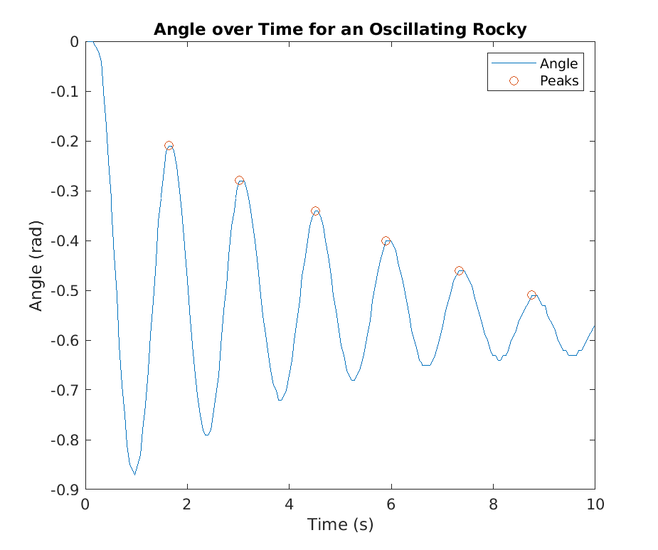

# Base Model

The base model for Rocky is an inverted pendulum. 
It is approximated to a long rod of an effective
length $l_{eff}$.
Also, it has two wheels and an axle at the bottom,
which are connected to a motor.
The motor is controlled by a control system,
which takes in the angle (displacement) of the system
and outputs a rotational force on the axle, preferably
one that helps the inverted pendulum stabilize itself.

We have two main measures for determining the success
of our control system.

1. Rocky should not fall if given a disturbance of
$30^\circ$ or less. This disturbance would have a
magnitude of $\textless 30^\circ$ degrees and
last about 0.1 seconds. We believe this is an
achievable goal and should protect
Rocky from most common disturbances in the environment.
2. Rocky should stabilize to an oscillation no greater
than $1^\circ$ $2$ seconds after a disturbance. This
would prove that Rocky can effectively reach a steady
state in a short period of time.

# Parameter Specifications

## Gyroscope Test

A gyroscope test was conducted to determine some physical
characteristics of the rocky system.
The "Rocky" was hung from its top and swung as a
(non-inverted) pendulum to observe its oscillation frequency
and effective length.

### Natural Frequency

A standard pendulum oscillates with a natural
frequency of $\sqrt\frac{g}{l}$, where $g$ is
acceleration due to gravity and $l$ is the length
of the pendulum. Our team determined the period
of oscillation of Rocky as if it were a standard
pendulum by observing how much time elapsed between
each oscillation, represented by the elapsed time
from the local maxima on a graph of angle versus time.

The value of $\omega_n$, or natural frequency,
is the mean of the elapsed times between each peak,
or $4.4142\ \textrm{rad/s}$

This is the natural frequency at which Rocky
oscillates as a normal pendulum. 

### Effective Length

Now that we have the natural frequency of the
pendulum, the length can be calculated using
$\omega_n = \sqrt\frac{g}{l_{eff}}$. Since we know
$\omega_n = 4.4142\ \textrm{rad/s}$, simplifying the equation
reveals that $l_{eff} = 0.5035\ \textrm{m}$, which
is almost $20"$

## Motor Test

The motor test is designed to determine the
characteristics of the motor and inverted
pendulum system. This specific test is a step
response for Rocky comparing an input motor
signal to the output velocity.
The characteristics of this motion help determine
the motor gain $K$ and time constant $\tau$.

### Motor Gain

The motor's gain is the ratio of an input motor
signal to an output velocity response. In this
test, the input signal has a magnitude of $200$
and we must solve for the steady state response.

The input signal is constant, and similar to charging
a capacitor, the velocity over time exponentially
approaches the steady state response as shown:
$v(t) = -200K(1-e^{-t/\tau})$. Note that since $K$ is
the ratio of the output and input signals, the input
signal multiplied by $K$ is the magnitude of the
output signal, or velocity. An exponential fit
in this form determines the velocity as a function
of time to be about
$-200 \cdot (0.0017) \cdot (1 - e^{-\frac{t}{0.0611}})$,
shown in Figure 2.

This means that the magnitude of the gain, $K$ is about
$0.0017$.

### Time Constant

Using the same data as above, we can determine how fast
the inverted pendulum approaches the steady state by
extracting $\tau$ from the line of best fit. In this
case, $\tau = 0.0611\ \textrm{s}$.

